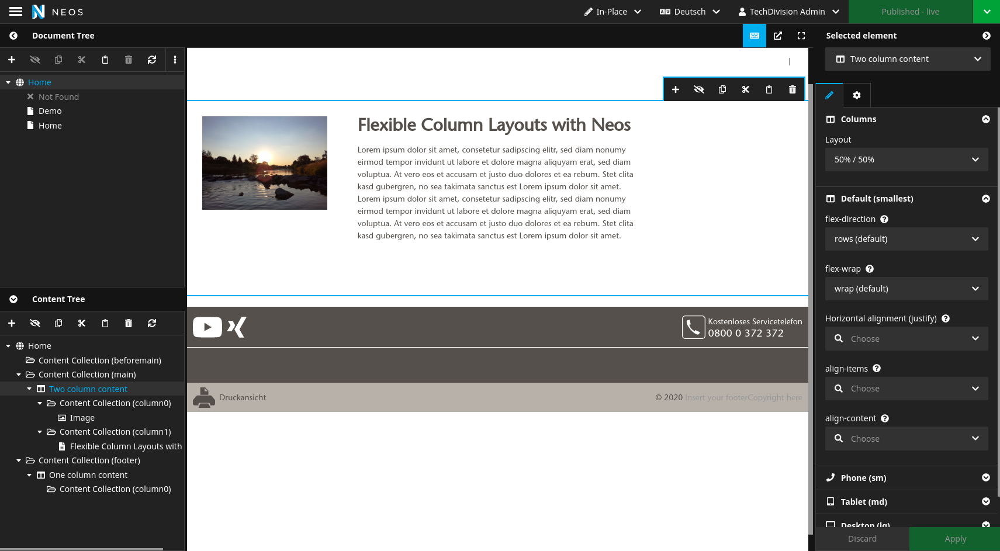

# Flex-ColumnLayouts for Neos CMS
Based on [tailwindcss](https://tailwindcss.com/), offers also css classes for [Bootstrap4](https://getbootstrap.com/docs/4.4/utilities/flex/).  
It extends your standard Neos-ColumnLayouts with flex properties so you can adjust every column with [css flex properties](https://css-tricks.com/snippets/css/a-guide-to-flexbox/).

## Get started
1. Install the package via packagist: Add `"techdivision/flexcolumnlayouts" : "~1.0"` to the require section of the composer.json or run `composer require techdivision/flexcolumnlayouts`.
2. If needed (i.e. nothing follow the instructions under "TailwindCSS" or "Bootstrap4"
3. Apply a node migration, if you want to use this feature on existing nodes. 

## How does it work?
You find a whole lot of settings now in your multi column nodes. 
We kept the css names instead of more speaking ones and added some links to an interactive documentation right in the inspector.
Flex is sometimes better understood if you try it out.  

**All the settings can be overidden per breakpoint.**


### NodeType level
Here you can see, how it looks like on NodeType level: You have plenty of options to adjust your columns



You have the following options for the whole grid  
* _Layout_: (as usual, but a bit more refined, see "Layouts")  
like 50/50, 60/33 or similar
* [flex-direction](https://yoksel.github.io/flex-cheatsheet/#section-flex-direction) 
* [flex-wrap](https://yoksel.github.io/flex-cheatsheet/#section-flex-wrap)
* [justify-content](https://yoksel.github.io/flex-cheatsheet/#section-justify-content)
* [align-items](https://yoksel.github.io/flex-cheatsheet/#section-align-items-self)
* [align-content](https://yoksel.github.io/flex-cheatsheet/#section-align-content)


### Column level 

Here you can see, how it looks like on Column level: There you can override your options.


* Override width: Here you can override the width on a column-basis, so that you can have individual grids like 25/33 and dont have to add fixed layouts for that
* [flex-order](https://yoksel.github.io/flex-cheatsheet/#section-order)
* [flex-shrink](https://yoksel.github.io/flex-cheatsheet/#section-flex-shrink)
* Inline-Styles: background-color, text-color and background-image

### Layouts
In standard Neos column layouts, you have no flexibility to add breakpoint-specific layouts.
The syntax we added seems a bit more complex on first sight (esp. on 4+ columns), but adds a whole new flexibility.  
It won't be adapted fast anyway.

Two columns-example:

```
100-100__100-100__50-50__50-50__50-50
=> 
100% / 100% base
100% / 100% for sm+ devices
50% / 50% for md+ devices
50% / 50% for lg+ devices
50% / 50% for xl+ devices
```

## Principle
The idea behind this package is to have any options for flex layouts available to columns so as to 
test things on a website and get ideas for which layouts do make some sense.  
From that you can build great columnlayouts yourself.  
Using all the options might be far too complicated for most editors, but gives a great toolbox for advanced ones.

**We consider it rather useful for prototyping or advanced editors.**

### TailwindCSS
If you already use tailwindcss in your project, you are all set and the classnames will be available to you.
If not, you have several choices:
1. (default) include the small css we deliver with this package which only include tailwind flex classnames 
2. include the latest [tailwind css build](https://tailwindcss.com/docs/installation) in your project (might be oversized)
3. include the scss files we provide in this package that produces tailwind-like classes
```scss
@import "Plugins/TechDivision.NodeTypes.FlexColumnLayouts/Resources/Private/Scss/TailwindFlexClasses";
```

### Bootstrap4
If you are using Bootstrap 4 in your project and have [Flex Utilities](https://getbootstrap.com/docs/4.4/utilities/flex/) available, you just have to:
* Add the small stylesheet 
`Resources/Public/Css/Bootstrap4AdditionalFlexClasses.css`  
to your page that adds some classes that bootstrap doesn't provide.
* Or include the scss file
```scss
@import "Plugins/TechDivision.NodeTypes.FlexColumnLayouts/Resources/Private/Scss/Bootstrap4AdditionalFlexClasses";
```
* For sure you need to add some fusion code to replace the tailwind classnames, which are a bit different:  
(For replacement, we have a mapping file, where you can see the differences: `Configuration/Settings.CssClassMapping.Bootstrap4.yaml` 
```
prototype(TechDivision.NodeTypes.FlexColumnLayouts:MultiColumn) {
    containerClasses.@process.replaceClasses {
            expression = ${CssClassMapping.replace(value, 'bootstrap4')}
            @position = 'end'
    }
    columns.itemRenderer.attributes.class.@process.replaceClasses {
            expression = ${CssClassMapping.replace(value, 'bootstrap4')}
            @position = 'end'
    }
}
```

### Node Migration
In case you do not start with a fresh project, but want to have those features available on your existing multi-column containers as well, we provided you with a node migration:  
**Use with caution and only if you know what you are doing!**

```shell
./flow node:migrate 20200904150412
```

#### Change breakpoint settings

If you include the scss files, you can overwrite the breakpoint variables defined by default:

```scss
$flexBreakpointConfiguration: (
        '640px': 'sm\\:',
        '768px': 'md\\:',
        '1024px': 'lg\\:',
        '1280px': 'xl\\:'
);
```
## Contribution
If you want to contribute or found a bug, pls provide a PR or file an issue - or get in touch with us!
 